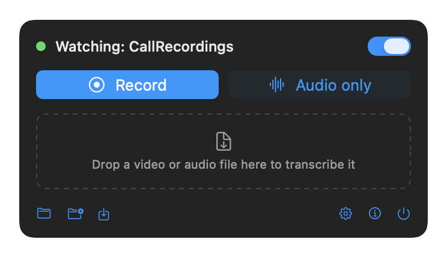
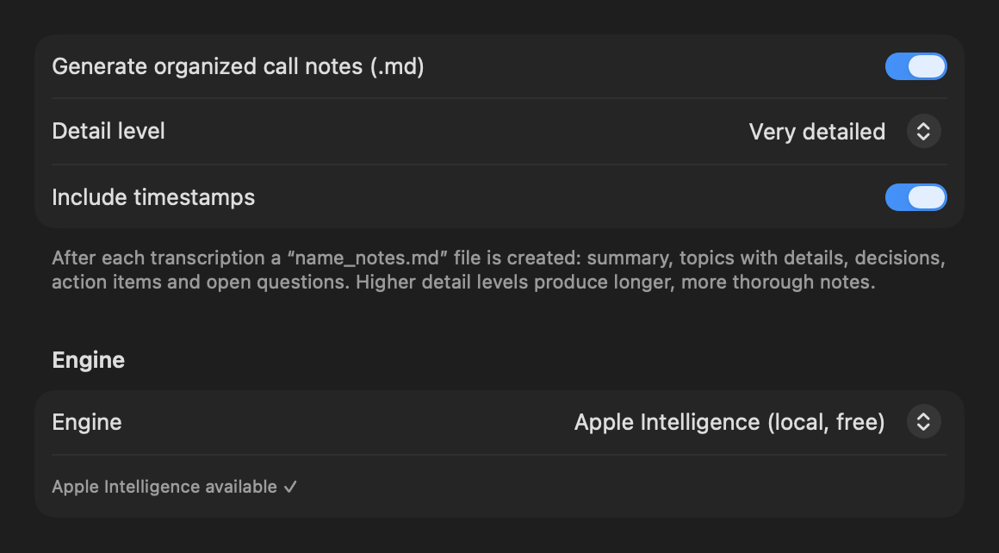
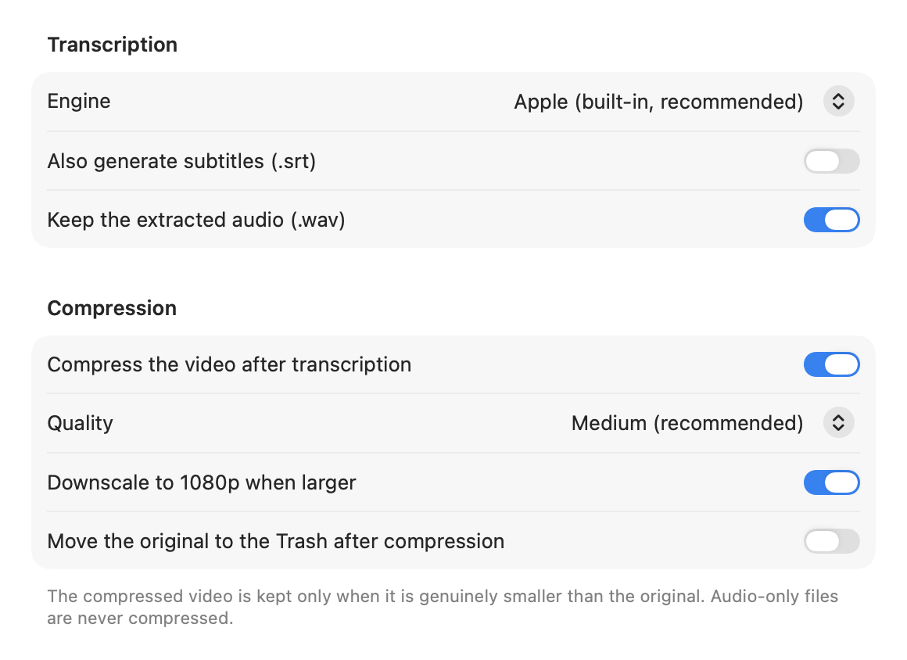
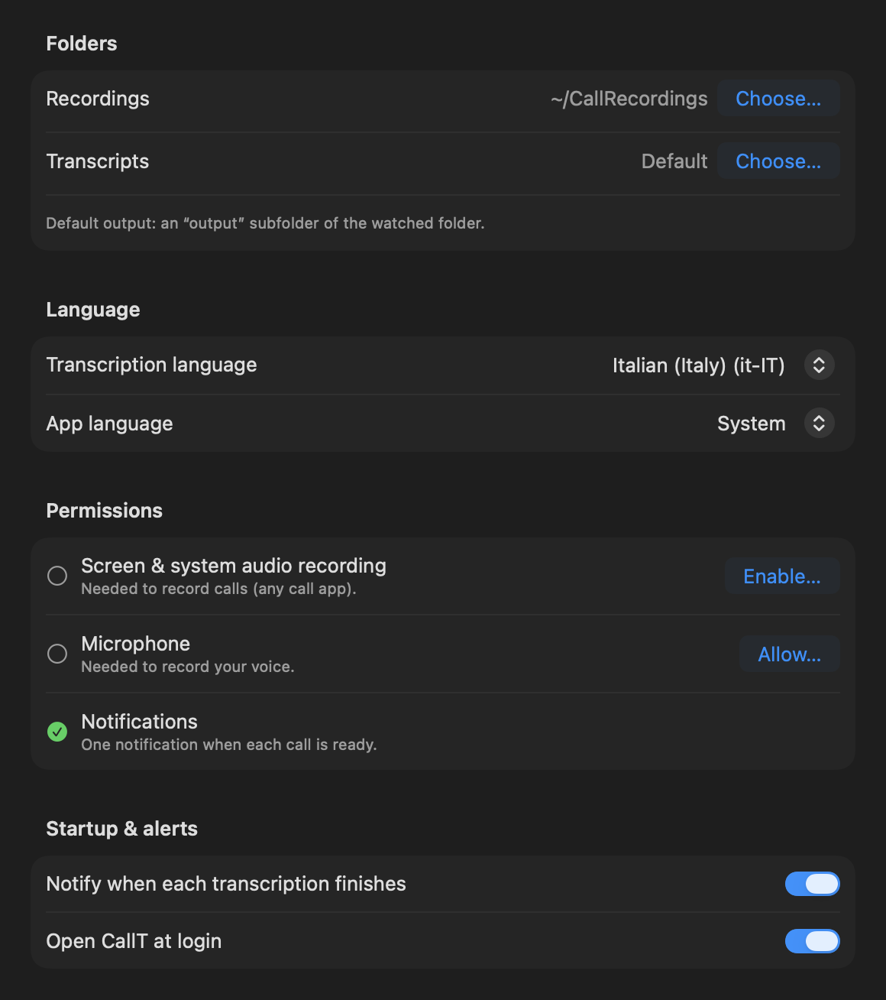

# CallT

*[Italiano](README.it.md)*

A macOS menu bar app that records, transcribes and summarizes your calls — entirely on-device by default.

Drop a video or audio file into a watched folder (or hit **Record call**) and CallT automatically produces a transcript, organized Markdown notes, and an HEVC-compressed copy of the video.

## Features

- **Call recording** (ScreenCaptureKit): system audio from *any* call tool (Zoom, Meet, Teams…) plus your microphone — with screen video, or audio-only (the screen is never written to disk in audio-only mode).
- **Speaker identification (diarization)** — fully on-device (CoreML via FluidAudio): transcripts become "Speaker 1/2/…" turns and the notes attribute positions and statements to each participant, using real names when the conversation reveals them.
- **On-device transcription** with the macOS 26 speech engine (the same one used by Notes and Voice Memos) — no external dependencies. Optionally uses `whisper-cli` + a ggml model when installed.
- **Organized notes (.md)**: after each transcription — summary, topics with details and timestamps, decisions, action items, open questions, written in the language of the call. Engines: Apple Intelligence on-device (default, free, map/reduce for long calls), Claude API, OpenRouter, DeepSeek, local Ollama, or any OpenAI-compatible endpoint (API keys live in the Keychain).
- **Smart HEVC compression**: bitrate computed from the source (never above 65% of the original), optional 1080p downscale, and a guarantee the compressed file is kept only when genuinely smaller.
- **Apple Shortcuts, both ways**: run a Shortcut with the transcript when a call finishes (delivery via mail/Slack/Notes/…), and a "Transcribe video" action exposed to the Shortcuts app (App Intents).
- **Folder watching** with a persistent registry (no double processing across restarts), serial queue, notifications, persistent settings, English/Italian UI.
- Audio-only files (m4a, mp3, wav, aiff, flac) are transcribed too — voice memos welcome.
- MKV supported when ffmpeg is installed (AVFoundation cannot read it).

## Screenshots

| Menu | Notes engines |
|---|---|
|  |  |

| Processing | General |
|---|---|
|  |  |

Screenshots are rendered straight from the real UI: `CallT --render-screenshots <dir>`.

## Requirements

- macOS 26 (Tahoe) or later. Xcode 26 to build.

## Install

Download `CallT.dmg` from the releases and drag CallT to Applications — or use Homebrew:

```sh
brew install --cask anhonestboy/tap/callt
```
 On first launch macOS blocks unsigned apps: open **System Settings → Privacy & Security → Open Anyway** (one time only). To record calls you will also be asked for Screen & System Audio Recording and Microphone permissions.

Or build from source:

```sh
scripts/build.sh              # arm64 build → build.noindex/CallT.app
scripts/build.sh --universal  # arm64 + x86_64
scripts/package.sh            # universal build + distributable build.noindex/CallT.dmg
```

The build is a manual `swiftc` pipeline (compile, bundle, extract App Intents metadata with `appintentsmetadataprocessor`, ad-hoc sign): it does not require `xcodebuild`. To work in Xcode, `xcodegen generate` (requires `brew install xcodegen`) produces `CallT.xcodeproj` from `project.yml`.

The app icon is regenerated with `swift scripts/make_icon.swift Resources` (same SF "waveform" glyph used in the menu bar).

## Privacy

Everything runs on your Mac: recording, transcription, compression and (by default) note generation. Nothing leaves the machine unless you explicitly select a cloud notes engine (Claude, OpenRouter, DeepSeek, custom) — in that case the transcript is sent to that provider, as stated in the settings. API keys are stored in the macOS Keychain.

## Project layout

```
Sources/
  CallTApp.swift            entry point (MenuBarExtra + Settings scene)
  AppState.swift            central state, serial queue, folder monitoring
  Pipeline.swift            orchestration: audio → transcript → notes → compression → delivery
  Settings.swift            UserDefaults keys/values
  FolderWatcher.swift       folder watching (kqueue) + file-stability wait
  VideoCompressor.swift     HEVC via AVAssetReader/Writer, size guarantee
  AudioExtractor.swift      M4A/WAV extraction via AVFoundation
  FFmpegHelper.swift        MKV path (only when ffmpeg is installed)
  ProcessRunner.swift       subprocess with timeout and line streaming
  ProcessedRegistry.swift   persistent registry of processed files
  ShortcutRunner.swift      `shortcuts` CLI integration
  Notifier.swift, LogStore.swift, Job.swift
  Recording/                CallRecorder (ScreenCaptureKit) + audio-only writer
  Notes/                    notes generator + engines (Apple, Claude, OpenAI-compatible)
  Transcription/            Transcript (+SRT), AppleTranscriber, WhisperTranscriber
  UI/                       MenuContent, SettingsView
  Intents/                  "Transcribe video" App Intent + AppShortcutsProvider
Resources/                  icon + localizations (en base, it)
scripts/                    build.sh, package.sh, make_icon.swift
```

## Credits

Created by **Maurizio Palumbo** ([werootbox](mailto:hello@werootbox.com)).

Built with [Claude Code](https://claude.com/claude-code) (Anthropic). CallT stands on excellent shoulders:

- **Apple frameworks** — ScreenCaptureKit (recording), Speech/SpeechAnalyzer (transcription), FoundationModels/Apple Intelligence (on-device notes), AVFoundation (audio/video processing), App Intents (Shortcuts)
- **[FluidAudio](https://github.com/FluidInference/FluidAudio)** (Apache-2.0) — on-device speaker diarization
- **[whisper.cpp](https://github.com/ggml-org/whisper.cpp)** — optional transcription engine
- **[ffmpeg](https://ffmpeg.org)** — optional MKV support
- Optional notes providers: [Anthropic](https://www.anthropic.com), [OpenRouter](https://openrouter.ai), [DeepSeek](https://deepseek.com), [Ollama](https://ollama.com)

## License

MIT — see [LICENSE](../LICENSE).
